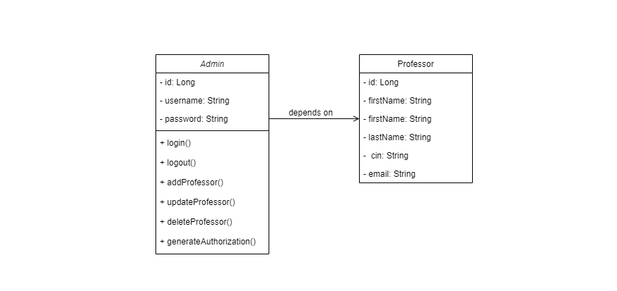

# Professor Work Authorization Project
This project is a Professor Work Authorization system that allows an administrator to manage professors, including adding, deleting, and updating their information. Additionally, the system provides the ability to generate printable work authorizations for professors.

## Features
### Administrator functionality:
- Add a new professor to the system
- Delete an existing professor
- Update professor information (e.g., name, contact details, employment status)
- Work Authorization generation:
- Generate printable work authorizations for professors
### Technologies Used:
The project utilizes the following technologies:

- Hibernate: Object-relational mapping (ORM) framework for database interaction
- JSTL (JavaServer Pages Standard Tag Library): Simplifies the integration of Java code and JSP pages
- HQL (Hibernate Query Language): A powerful query language for Hibernate
- EL (Expression Language): Simplifies accessing and manipulating data in JSP pages
- JEE (Java Enterprise Edition): A collection of Java APIs and specifications for building enterprise applications
- Bootstrap: A popular front-end framework for creating responsive and visually appealing web interfaces.
- MySQL: A relational database management system used for storing and retrieving data efficiently.

### Setup and Configuration
To set up and run the project locally, follow these steps:

1. Clone the repository:
```git clone https://github.com/your-username/professor-work-authorization.git```
2. Configure the database connection:

Modify the Hibernate configuration file (hibernate.cfg.xml or persistence.xml) with the appropriate database connection details (e.g., database URL, username, password).

3. Build and package the project:

If you're using Maven, run the following command:
```mvn clean package```
If you're using a different build tool or IDE, follow the appropriate steps to build and package the project.

4. Deploy the application:

Deploy the generated WAR file to a Java EE-compliant application server (e.g., Apache Tomcat, WildFly, GlassFish).
Access the application:

Open a web browser and navigate to http://localhost:5050/teacher-authorization-management-system (replace 5050 with the appropriate port if your application server uses a different port).

## Class Diagram:
